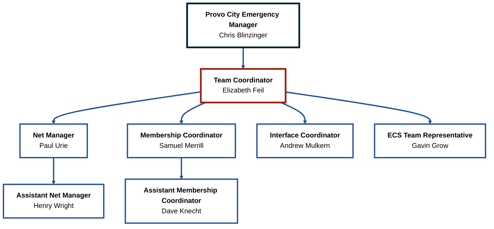

# Leadership Team

---

### Provo City Emergency Manager  
**Chris Blinzinger**

View Details

- **Email:** cblinzinger@provo.gov  
- **Role:** Oversees emergency preparedness and response for Provo City.
- **Bio:** Chris Blinzinger is the Emergency Manager for Provo City. He has held this position since 2010 and has been involved in Emergency Response for over 20 years. As a volunteer Fireman and EMT in Colorado, he responded for the County Ambulance Service and Local Fire Protection District. Chris graduated from UVU with a degree in Emergency Services Administration received a Master’s Degree in Crisis and Emergency Management from UNLV in 2013 and received his Certified Emergency Manager (CEM) credential from IAEM in 2016.  He is a graduate of FEMA’s Advanced Leadership Academy 2016. Chris is a Past- President of the Utah Emergency Managers Association (UEMA) 2015, served as the 2014 Chairman for the Utah County Local Emergency Planning Committee (LEPC), and a member of the Utah County Healthcare Coalition. Chris loves the outdoors and the Rocky Mountains provide ample opportunities for adventure during all seasons. He and his wife toured the Pacific Coast on bicycles in 2015 and he spends several weeks each year pedaling through the great scenery of the Country.

---

### Team Coordinator  
**Elizabeth Feil**

View Details

- **Callsign(s):** KK7IUS
- **Operator Privileges:** Technician
- **Email:** elzabah@gmail.com
- **Role:** Leads PACT operations and coordination with city officials.
- **Bio:** Elizabeth Feil, LCSW, is the Therapist Supervisor at the Provo Family Clinic She has been working as a therapist at Wasatch Mental Health since 2002. She is trained in EMDR, Trust-Based Relational Intervention, Crisis Intervention, Motivational Interviewing, Trauma-focused CBT, and the Strengthening Families Program. Elizabeth is a Trust-Based Relational Intervention (TBRI) Practitioner. Elizabeth works primarily with youth ages 11-17 and their families but also has a lot of experience with elementary school aged children, PLUS she speaks Spanish. Elizabeth was very involved in implementing a grant-funded interdisciplinary approach involving Provo School District, Intermountain Health Clinics, and Wasatch Mental Health.

---

### Net Manager  
**Paul Urie**

View Details

- **Callsign(s):** N7QOC
- **Operator Privileges:** Amateur Extra
- **Email:** pmurie@xmission.com 
- **Role:** Manages net operations and communications protocols.
- **Bio:** Paul is a retired pathologist who specialized in anatomic & clinical pathology. He received his medical degree from University of Utah School of Medicine and practiced medicine for more than 45 years.

---

### Assistant Net Manager  
**Henry Wright**

View Details

- **Callsign(s):** KK7LBK
- **Operator Privileges:** General
- **Email:** henrywright978@gmail.com
- **Role:** Supports net operations and assists during activations.
- **Bio:** xxx

---

### Membership Coordinator  
**Samuel Merrill**

View Details

- **Callsign(s):** K3BYU & WSGN400
- **Operator Privileges:** General
- **Email:** samuelfrederickmerrill@gmail.com 
- **Role:** Oversees PACT member onboarding and engagement.
- **Bio:** Samuel has been a part of Amateur Radio since 2023. He joined PACT in 2025.

---

### Assistant Membership Coordinator  
**Dave Knecht**

View Details

- **Callsign(s):** KF7RJO
- **Operator Privileges:** Technician
- **Email:** dnknecht@yahoo.com
- **Role:** Assists with PACT member onboarding and engagement.
- **Bio:** Dave served as a city council member for Provo from 2002-2006. During that time he was both the chair can vice-chair of the council. Dave has also been a neighborhood chair and works for the Provo West FM group.

---

### Interface Coordinator  
**Andrew Mulkern**

Learn More

- **Callsign(s):** KK7RXQ
- **Operator Privileges:** Amateur Extra
- **Email:** 11070547@uvu.edu
- **Role:** Plans and Coordinates Quarterly Interface Meetings.
- **Bio:** Andrew has been an Amateur Radio operator for two years, holding an Amateur Extra license. During this time, he spent one year with the Freedom Academy Amateur Radio Club. Andrew is a certified EMT and volunteers for ICS drills with UVU EMS.

---

### ECS Team Representative  
**Gavin Grow**

View Details

- **Callsign(s):** K9GKG
- **Operator Privileges:** Technician
- **Email:** k9gkg@ecsteam.org
- **Role:** Coordinates with Emergency Communications Services.
- **Bio:** Gavin currently works as a special education teacher for the provo school district. Previously he worked as a technology and integration specialist. Gavin is currently the President of the ECS team. Gavin graduated with a BS in Business and Information Systems and a MBA from the University of Phoenix. Gavin served for over 20 years with the Boy Scouts of America. During that time, he ran the National Youth Leadership Training (NYLT) program.

